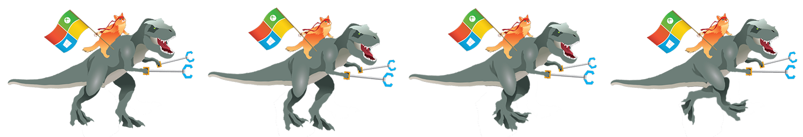

# DinoJump

### A simple UWP game written in JavaScript, with CreateJS





## Introduction

In order to publish your app to the Windows Store, it must be written for the UWP (Universal Windows Platform). However, the UWP is flexible, and allows a wide variety of languages and frameworks to be used.
To prove the point, this app is a very simple game written in JavaScript, making use of several CreateJS libraries, and demonstrating how to draw sprites, create a game loop, work with the keyboard and mouse, and how to adapting to different screen sizes.

This project is created for use with Visual Studio. As a UWP app it can be published to the Windows Store, but with some minor changes, it can also hosted on a website or adapted to other platforms. 

**Note:** This is a not a complete (or good!) game; it is a simple app, designed to demonstrate programming with JavaScript and a third party library to make an app ready to publish to the Windows Store.


## Requirements

To play with this project, you'll need the following:

* A Windows computer (or a virtual machine) running the current version of Windows 10.
* A copy of Visual Studio. The free Visual Studio Community Edition can be downloaded from the [Visual Studio homepage](http://visualstudio.com).

This project makes use of the CreateJS JavaScript framework. CreateJS is a free set of tools, released under the MIT license, designed to make it easy to create sprite-based games. 
It is already present in the project (look for *js/easeljs-0.8.2.min.js*, and *js/preloadjs-0.6.2.min.js* in the Solution Explorer view). Full details can be found at the [CreateJS home page](http://www.createjs.com).


## Getting started

The complete source code for the app is stored on [GitHub](https://github.com/GrantMeStrength/DinoJumpDemo).

The simplest way to get started it to visit GitHub, click on the green **Clone or download** button, and select **Open in Visual Studio**. 

You can also download the project as a zip, or use any other standard ways to work with [GitHub projects](https://msdn.microsoft.com/en-us/windows/uwp/get-started/get-uwp-app-samples).

Once the solution has been loaded into Visual Studio, you'll see several files, including:

* Images/ - a folder containing the various icons required by UWP apps, as well as the game SpriteSheet and some other sprites.
* js/ - a folder containing the JavaScript files. The main.js file is our game, the other files are EaselJS and PreloadJS.
* Licenses/ - a folder containing various license documents. Please read them.
* index.html - the webpage which contains the canvas object which hosts the game's graphics.

Now you can run the game!

Press **F5** to start the app running. You should see a windows open, and our familar dinosaur standing in an idyllic (if sparse) landscape. We will now examine the app, and explain some important parts - and unlock the game functionality as we go.

**Note:** Something go wrong? First be sure you have installed Visual Studio with web support. You can check by creating a new project - if there is no support for JavaScript, you will need to re-install Visual Studio and check this box:


## Walkthough

If you have started the game with F5, you're probably wondering what is going on. And the answer "not a lot", as a lot of the code is currently commented out. So far, all you'll see is the Dinosaur, and a ineffectual request to press Space. 

1. Setting the Stage

If you open and examine **index.html**, you'll see it's almost empty. This file is the default page of our app, and it does only two important things. First, it includes the JavaScript source code for the EaselJS and PreloadJS libraries, and also **main.js**, which is our own source code file.
Secondly, it defines a &lt;canvas&gt; tag, which is where all our graphics are going to appear. A &lt;canvas&gt; is a standard HTML5 document component. We give it a name (gameCanvas) so our code over in **main.js** can reference it.
By the way, if you are going to write your own JavaScript game from scratch, you will need to copy the EaselJS and PreloadJS files into your solution, and create a canvas. Then you are good to go.

EaselJS provides us with a new object called a *stage*. The stage is linked to the canvas, and is used for displaying images and text. Any object we want to be displayed on the stage must first be added, like this:

```
    stage.addChild(myObject);
```

Speaking of **main.js** you should open it up now.

2. Loading the bitmaps

The first thing we're going to do is add some little fluffy clouds to the stage. Once the game is running, they'll drift across the screen. The image for the cloud is already in the solution, in the Images folder.

Look through **main.js** until you find the **init()** function. This is called when the game starts, and it's where we begin to set up all our images.

Find the following code, and remove the comments (\\) from the line that references the cloud image. 

```
 manifest = [
		{ src: "walkingDino-SpriteSheet.png", id: "dino" },
		{ src: "barrel.png", id: "barrel" },
		{ src: "fluffy-cloud-small.png", id: "cloud" },
    ];
```

JavaScript needs a little help when it comes to loading resources such as images, and so we're using a feature of the CreateJS library that can preload images, called a queue. 
Once the images are available, the queue will tell us they are ready. In order to do that, we first create a new object that lists all our images, and then we create a LoadQueue object.
You'll see in the following code how it is set-up to call a function called **loadingComplete()** when everything is ready.

If you look in **loadingComplete()** now, you'll see a commented-out section that creates the clouds. Remove the comments, so it looks like this:

```
    // Create some clouds to drift by..
    for (var i = 0; i < 3; i++) {
        cloud[i] = new createjs.Bitmap(loader.getResult("cloud"));
        cloud[i].x = Math.random()*1024;
        cloud[i].y = 64 + i * 48;
        stage.addChild(cloud[i]);
    }
```
This code creates the cloud objects using our pre-loaded image, sets their location, and then adds them to the stage.

Run the app again (press F5) and you'll see our clouds have appeared.

3. Moving the clouds

Now we're going to make the clouds move. The secret to moving clouds - and moving anything, in fact - is to set-up a function that is repeatedly called multiple times a second. 
Every time the function is called, it redraws the graphics in a slightly different place.

The code to do that is already in the **main.js** file, provided by the CreateJS library, EaselJS. It looks like this:

```
    // Set up the game loop and keyboard handler.
    // The keyword 'tick' is required to automatically animated the sprite.
    createjs.Ticker.timingMode = createjs.Ticker.RAF;
    createjs.Ticker.addEventListener("tick", gameLoop);
```

This code will call a function called **gameLoop()** between 30 and 60 frames a second. The exact speed depends on the speed of your computer.

Look for the **gameLoop()** function now, and down towards the bottom you'll see a function called **animateClouds()**. Change it so that it is not commented out.

```
    // Move clouds
    animateClouds();
```

If you look at the defintion of this function, you'll see how it takes at each cloud in turn, and changes its x co-ordinate. If the x-ordinate is off the screen, it is reset to the far right of the screen.

If you run the app now, you'll see that the clouds have started drifting. Finally we have motion!

4. Adding keyboard and mouse input

A game that you can't interact with isn't a game. So let's now allow the player to use the keyboard or the mouse. Back in the **loadingComplete()** function, you'll see the following. Remove the comments.

```
    // This code will call the method 'keyboardPressed' is the user presses a key.
    this.document.onkeydown = keyboardPressed;

    // Add support for mouse clicks
    stage.on("stagemousedown", mouseClicked);
```

Now we have two functions being called whenever the player does something. Both the functions call **userDidSomething()**, which decides what the game is currently doing, and what needs to happen next as a result.

Try running the app again, and finally you'll be able to start playing. Press space (or click) to start things happening. You'll see a barrel come rolling towards you: press space or click again at just the right time, and the dinosaur will leap. Time it wrong, and your game is over.


5. Add resizing support

We're almost done here! There's one annoying problem to take care of first, though. When the game is running, try resizing the windows. You'll see that the game quickly becomes messed up, as objects are no longer where they should be.
We can take care of that by creating a handler for the window resizing event that is generated when the player resizes the window, or if the device is rotated from landscape to portrait.

The code to do this is already present (in fact, we call it when the game first starts, to make sure the default window size works - when a UWP app is launched, you can't be certain what size the window will be, or specify a size).

Just uncomment this line:

```
    // This code makes the app call the method 'resizeGameWindow' if the user resizes the current window.
     window.addEventListener('resize', resizeGameWindow);
```

If you run the app again, you should be able to resize the window and get better results.

## Publishing to the Windows Store

As a UWP app, it is possible to publish this project to the Windows Store. There are a few steps to the process.

1. You must be registered as a Windows Developer.
2. You must test the app using the Store approval tool.

For more details, see [Publishing your Windows Store app]().

## Suggestions

What next? Here are a few suggestions for features to add to your (soon to be) award-winning app.

1. Sound. The CreateJS library includes support for sound.
2. Gamepad support.


## Other links

* [Make a simple Windows game with JavaScript](https://www.sitepoint.com/creating-a-simple-windows-8-game-with-javascript-game-basics-createjseaseljs/)
* [Picking an HTML/JS game engine](https://html5gameengine.com/)
* [Using CreateJS in your JS based game](https://blogs.msdn.microsoft.com/cbowen/2012/09/19/using-createjs-in-your-javascript-based-windows-8-game/)
